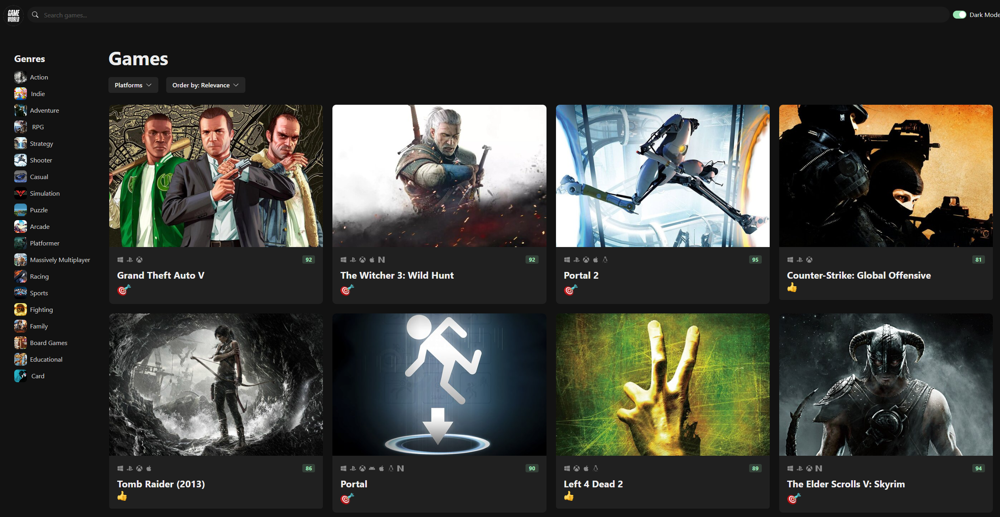
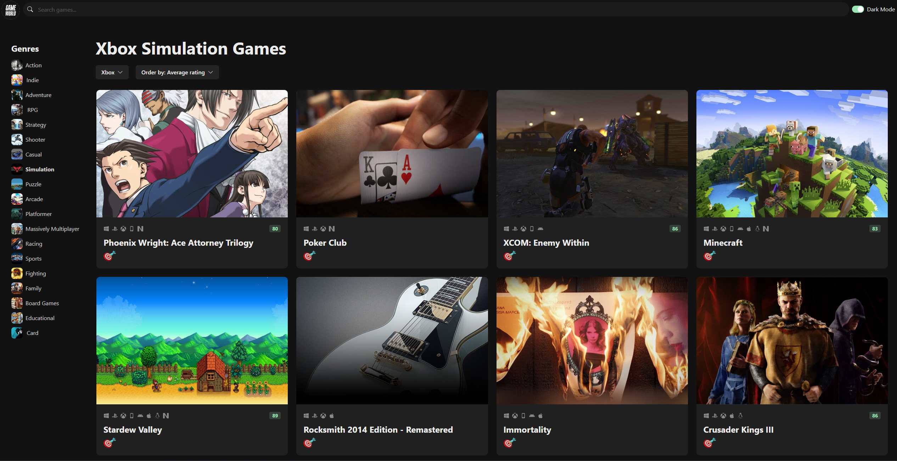
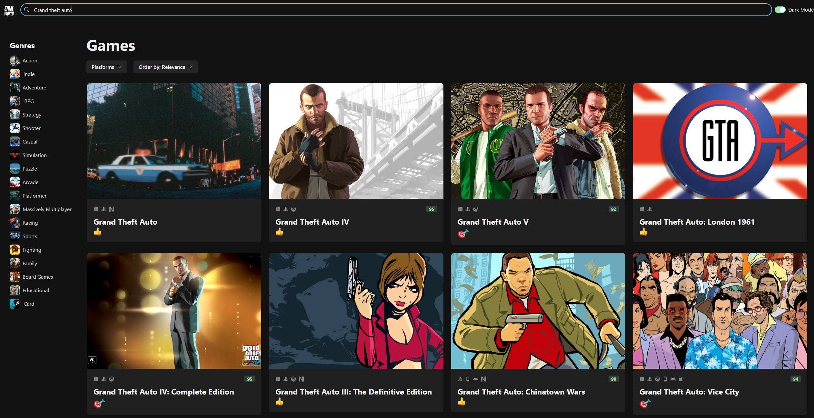
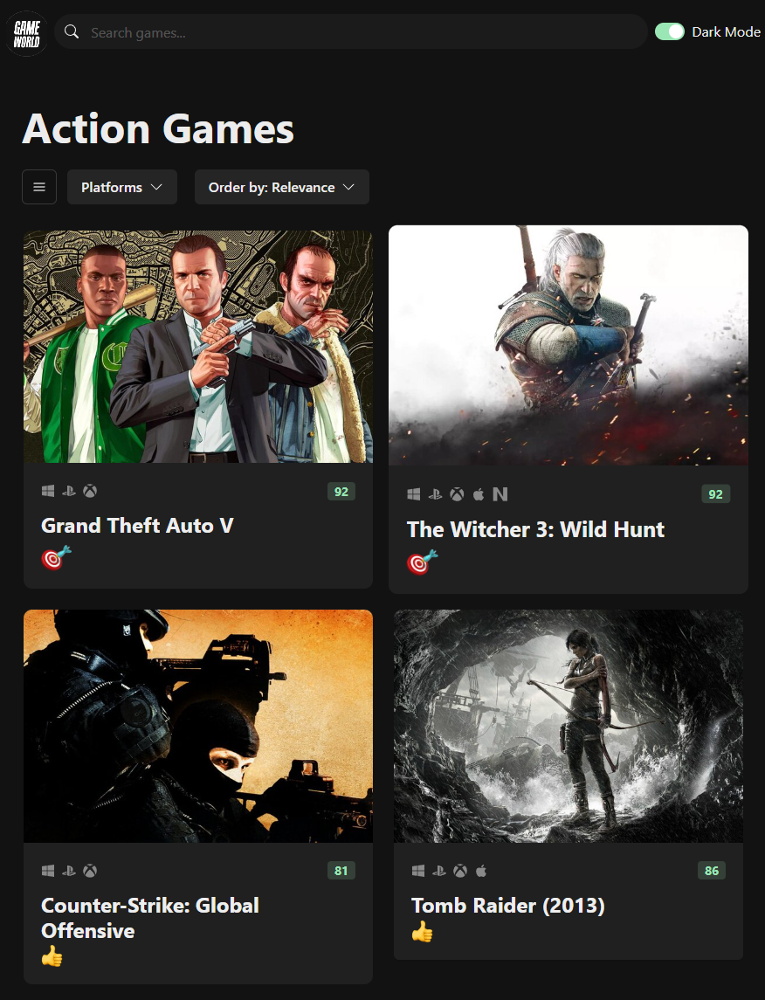
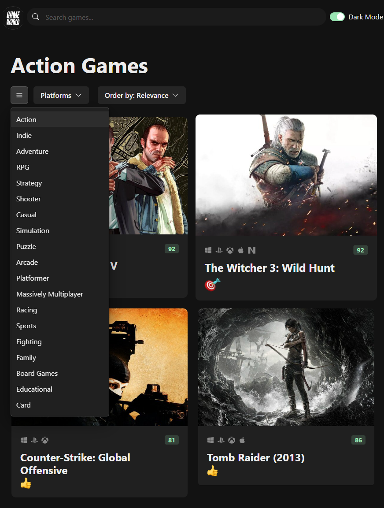

# GameHub

[Live Demo](https://gameworld-v2.vercel.app/)

GameHub is a video game discovery web app that helps you find new and interesting games to play. With GameHub, you can search for games by platform, genre, and more.

## Table of content:

- [Project Description](#project-description)
- [Stack and Frameworks](#tech-stack)
- [Features](#features)
- [Dependencies](#dependencies)
- [Setup](#setup)
- [Screenshots](#screenshots)

## Project Description:

### Theme:

This project is an online game library that allows gamers to look for games using diffrenet filters like Platforms and Genres.

### Overview:

Game World is an up-to-date game library that has a very wide selection of games that allows users to find their desired game and decide whether it's of their interest or not by showing them all the information they might need to know about this game.

## Tech Stack:

- Typescript
- React
- HTML
- CSS
- Chakra-UI
- Git
- VSCode
- Axios API
- Rawg API
- Zustand
- Vite

## Features:

- Filtering
- Screenshots
- Trailers
- Game Hisotry
- Rating
- Sorting
- Searching
- Dark Mode
- Mobile responsiven

## Code Style:

- Prettier
- Pascal Case

## Dependencies:

- "@chakra-ui/icons": "^2.1.1"
- "@chakra-ui/react": "^2.5.1"
- "@emotion/react": "^11.10.6"
- "@emotion/styled": "^11.10.6"
- "@tanstack/react-query": "4.28"
- "@tanstack/react-query-devtools": "4.28"
- "axios": "^1.3.4"
- "framer-motion": "^10.0.1"
- "ms": "^2.1.3"
- "react": "^18.2.0"
- "react-dom": "^18.2.0"
- "react-icons": "^4.7.1"
- "react-infinite-scroll-component": "6.1"
- "react-router-dom": "^6.10.0"
- "zustand": "^4.3.7"
- "@types/ms": "^0.7.33"
- "@types/react": "^18.0.27"
- "@types/react-dom": "^18.0.10"
- "@vitejs/plugin-react": "^3.1.0"
- "typescript": "^4.9.3"
- "vite": "^4.1.0"

## Setup:

1. Clone this repository to your local machine.
2. Run `npm install` to install the required dependencies.
3. Get a RAWG API key at https://rawg.io/apidocs. You'll have to create an account first.
4. Add the API key to **src/services/api-client.ts**
5. Run `npm run dev` to start the web server.

## Screenshots:

### Homepage

### Game Details

### Using filters

### Searching

### Mobile View

### Mobile Genre Filter

